# AVR Crash Course
The crash course will focus mostly on atmega328 microcontroller  

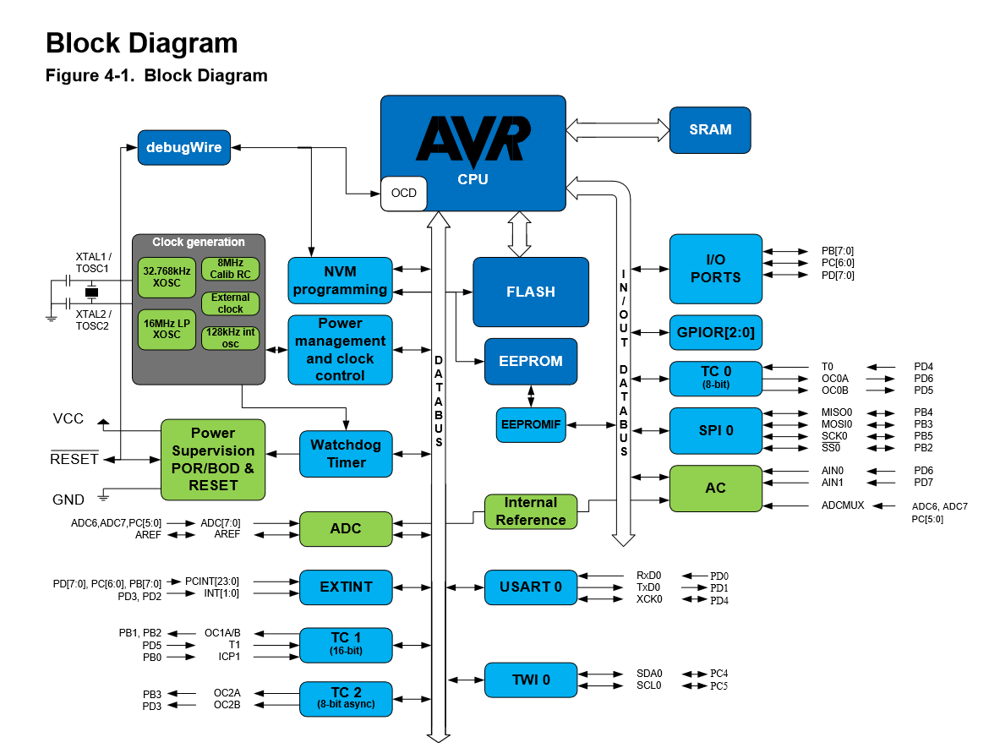
## Microcontroller Architecture
A microcontroller is a processor packaged with memory and peripherals, typically on the same silicon chip.  
A processor on it's own is dumb device that can only read and write to and from memory, so it can't do any side effect on the world, it can't draw on a screen, it can't light an LED, so we need other hardware blocks that helps the processor do these tasks - side effects on the outside world - these hardware blocks we refere to them as peripherals.  
Usually the way a processor talks to these peripherals to command them to do things is by making these peripherals act like pieces of memory that the processor can write to and read from, this is what we call memory mapped peripherals, so for example if we have input and output pins on the microcontroller, writing a 1 to specific bit in a specific address in memory makes the voltage on that pin high (5V) and writing a 0 to that same bit makes the voltage on that pin low (0V), but to the processor these are just parts of memory, it has no "awareness" that these addresses are special.  
these addresses are often called registers or special function registers.  
## AVR 8 bit Architecture
We won't need to get too much in the details of the AVR architecture, but what we need to know the processor core is 8 bit, which means it can only do operation in 1 clock cycle on 8 bit data, the program counter is 16 bits,it has 16 bit instruction, and a 16 bit address space, which means all pointers are 16 bit.
## AVR LibC
To make things easier on us someone already collected these memory addresses and gave them useful easy to remember names that indicate their functionality, and put all these in what we call AVR LibC, it's the c standard library + extra stuff built for the avr microcontrollers.

## Peripherals
### GPIO
GPIO stands for general purpose digital inputs and outputs, these are basically the pins of the microntroller when we can use then as simple digit input and output, reading a 0V or a 5V as 0 or 1 in from special function register, or outputting a 0V or a 5V by writing to some special function register.  
Usually a number of pins are bundled together and treated as one unit called a port, in AVR a port is 8 pins or less.  
on the ATmega328 there are 3 ports , port B, port C, and port D.  
and the pins will be named in reference to these port names, for example pin 5 of port C will be called **PC5**.
#### Pins
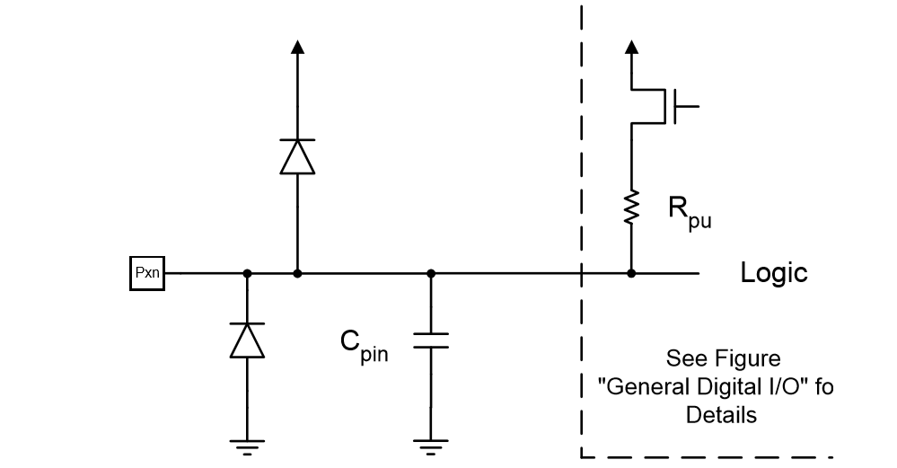
each pin can be used as input, or output, and each pin has protection clamping diods and a capacitor to limit noise.
also each pin when in input mode has a pull up resistor.
#### Registers
all register names for GPIO will end in an x, which should be replaced by the port name, for example DDRD referes to Data Direct Register for port D.  
##### DDRx - Data Direction Register
This register is used to configure if a pin will be used as input or output.  
setting a bit to 1 will make the pin associated with this bit act as output pin.  
and setting a bit to 0 will make the pin associated with this bit act as input.
#### PORTx - Port Output Data Register
When a pin is configured as output, write a 1 to bit in this register makes the pin associated with this bit high (5V), and setting the bit to 0 to will make the pin low (0V).
when a pin is configured as input, writing 1 to a bit will enable the pull-up resistor on that pin.
#### PINx - Port Input Data register
You can read the state of a pin (high or low) from this register regardless it's input or output.  
When a pin is configured as output, writing a 1 to a bit in this register will toggle that pin. (if it was high it will become low, and if it was low it will become high). 

#### Blink Example.
you can try the following example in protues.  
this code blinks an LED attached to pin 0 in port D
```C
// this file includes the fixed width integer types like uint8_t
#include <inttypes.h>
// this file includes the definitions for the GPIO special function registers
#include <avr/io.h>
// this file includes the function _delay_ms()
#include <util/delay.h>

int main(){ 
    // remember the set bit and clear bit from the c programming crash course
    // set pin 0 in port D as output by setting the bit PD0 to 1
    DDRD |= (1<<PD0);
    // set pin 0 low in port D by setting the bit PD0 to 0, just to start from a known state
    PORTD &= ~(1<<PD0);
    
    while (1){
        // set PD0 Hight
        PORTD |= (1<<PD0);
        // wait a second
        _delay_ms(1000);
        // set PD0 Low
        PORTD &= ~(1<<PD0);
        // wait a second
        _delay_ms(1000); 
    }
    return 0;
 }
```

after writing the code in the source code tab in protues, build the project.  
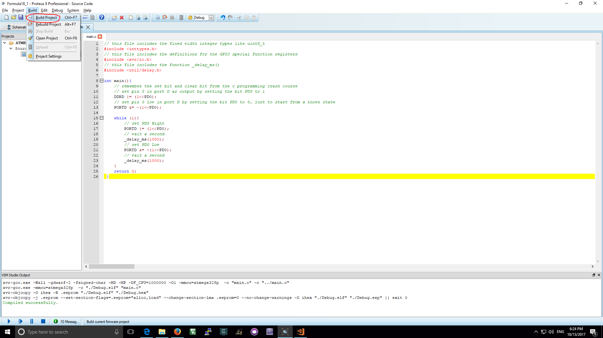  
after building the project run the simulation.
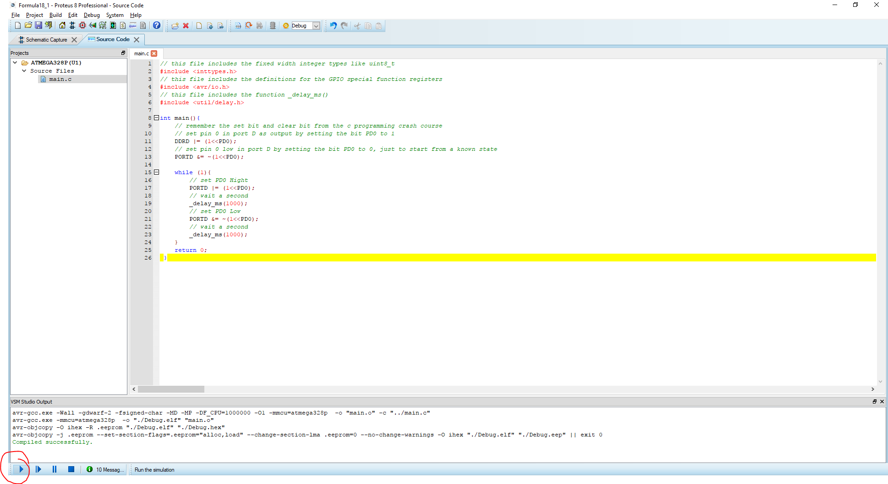  
the program will switch automatically to the schematics tab and you will notice a square next the pin PD0, and the square should be switching between red and blue every one second, which means you code is working correctly.   
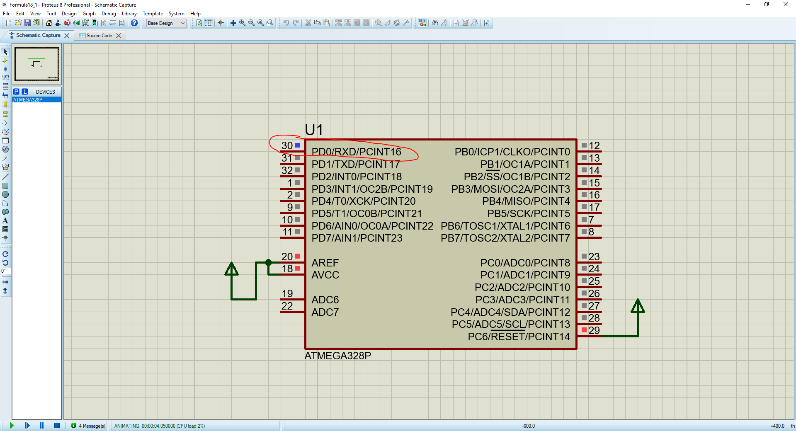
you can then simulate an actual LED from proteus library  
first open the proteus components library
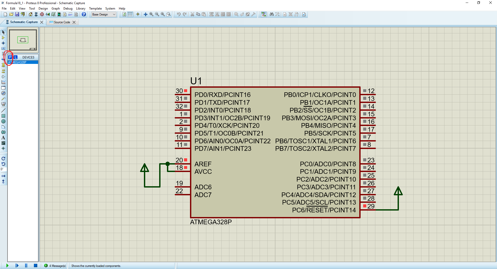
second choose an active LED with whatever color you like.  
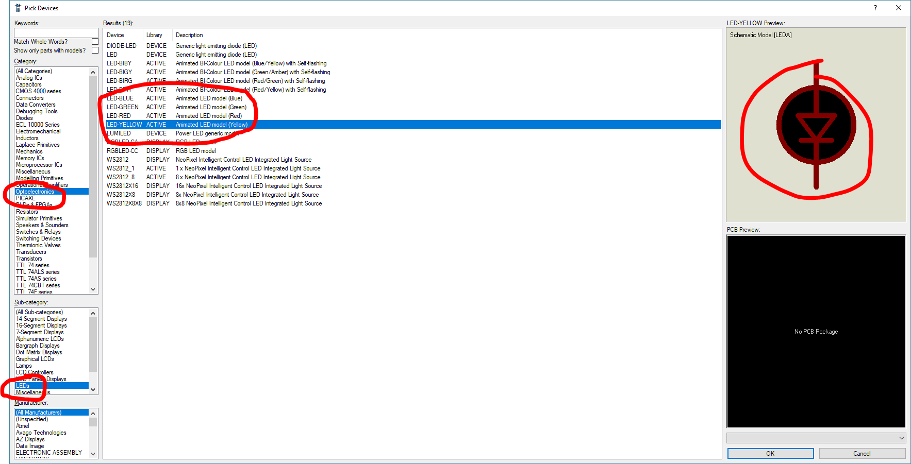
click ok and place the led and connect it to the pin and place a ground terminal to the other pin of the led.  
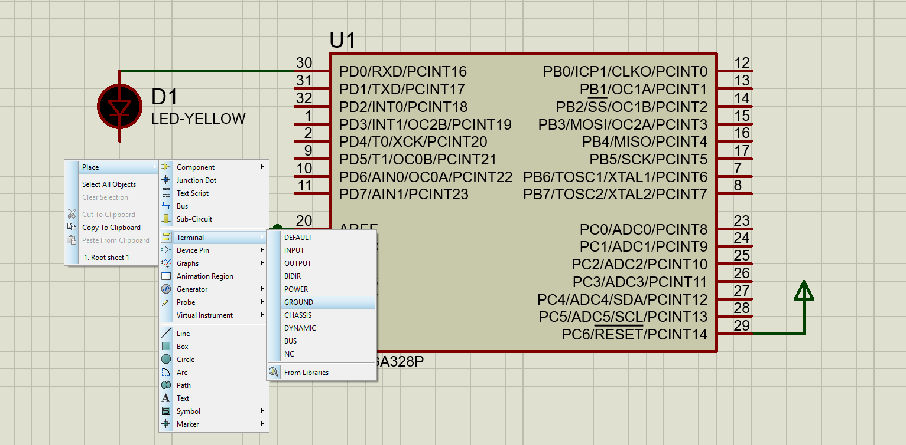
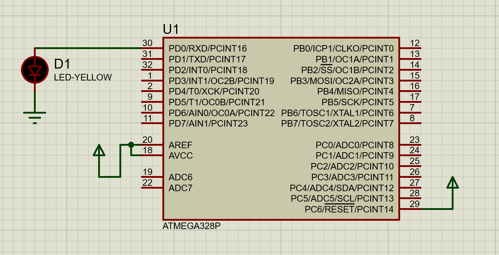
run the simlation again the LED should blink once every second.


#### button example
In this example we will light an led if button is pressed, otherwise the LED should be off.
```C
// this file includes the fixed width integer types like uint8_t
#include <inttypes.h>
// this file includes the definitions for the GPIO special function registers
#include <avr/io.h>
// this file includes the function _delay_ms()
#include <util/delay.h>

int main(){ 
    // remember the set bit and clear bit from the c programming crash course
    // set pin 0 in port D as output by setting the bit PD0 to 1
    DDRD |= (1<<PD0);
    // set pin 0 low in port D by setting the bit PD0 to 0, just to start from a known state
    PORTD &= ~(1<<PD0);
    // set pin 1 in port D as input
    DDRD &= ~(1<<PD1);

    while (1){
        // check if PD1 is high
        if((PIND & (1<<PD1)) != 0){
            // turn on LED
            PORTD |= (1<<PD0);
        }else{
            // turn off LED
            PORTD &= ~(1<<PD0);
        }
        // delay to stablize the simulation, this is not needed on real hardware
        _delay_ms(1);
    }
    return 0;
 }
```
connect the circuit as the image below.  
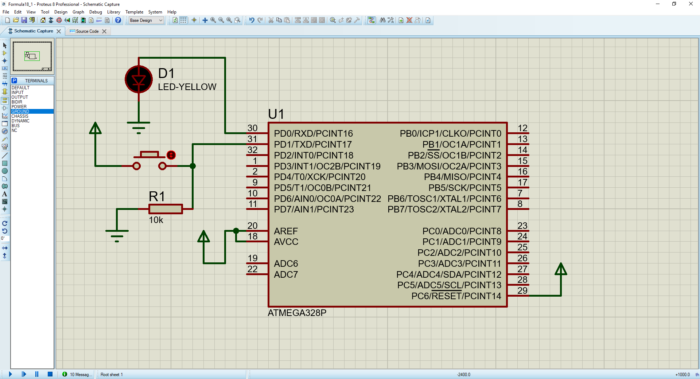
you can find the button in the library  
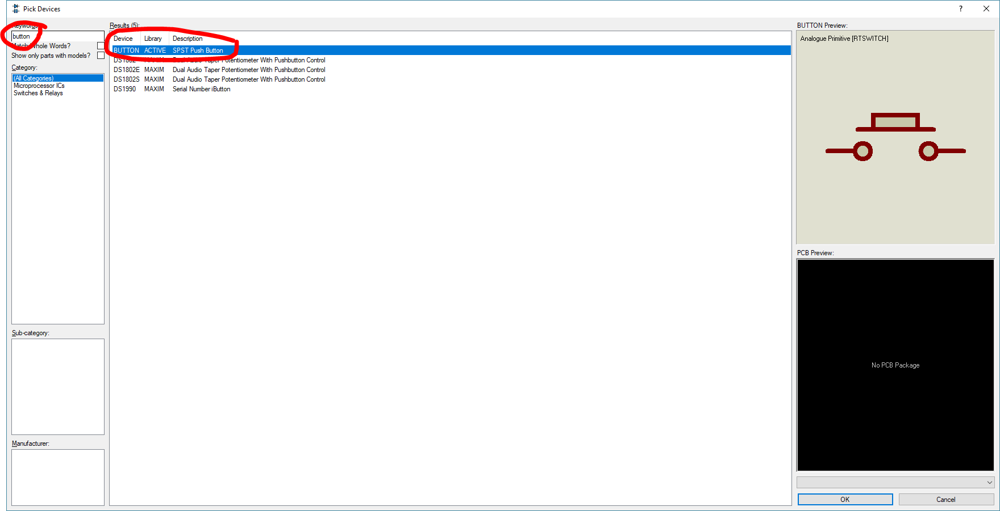
and you can fint the resistor in the library  
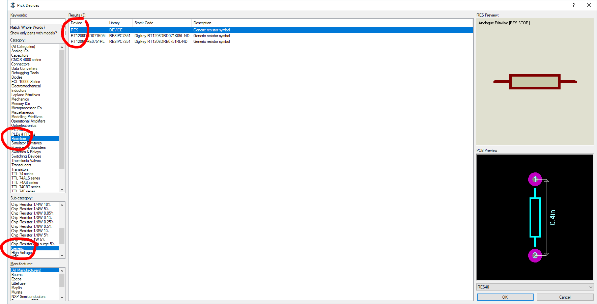
and the power terminal in the same place as the ground terminal.  
run the simulation and click the button to see your code running.  
you need the resistor connected to ground, this is called a pull down resistor,because leaving the pin open circuit usually leads to bad things happening, like noise in the air affecting the voltage on the pin.

# Homework
After following the steps above I encourge you to play around with gpio pins, and read the datasheet of the atmega328 the part talking about the I/O ports and pins.   
Then build the following projects.

## Project 1
build a project that by clicking the button once turns the LED on, and clicking it again turns the LED off.
## Project 2
build a project with 3 LEDs and a button, at the start LED1 should be blinking once every 500 milliseconds and LED2 and LED3 are off, if the button is clicked once, LED1 turns off and LED2 starts blinking at the same rate, if the button is clicked a second time LED2 turns of and LED3 starts blinking with the same rate.  
clicking the button once again should return to the first state (LED1 blinking, LED2 and LED3 are off)
## Project 3
build a project with an LED and a button, initially the LED is off, clicking the button once makes the LED start blinking once every 1 second, clicking again makes the LED start blinking faster (once every half a second), clicking again should make the LED blink slower again.