# How to simulate ATmega328p on proteus
## Required Software
1 - Protues 8.6  
2 - winAVR  
https://sourceforge.net/projects/winavr/files/WinAVR/20100110/WinAVR-20100110-install.exe/download

## Steps
After installing protues and winAVR  
1 - Run protues as admin    
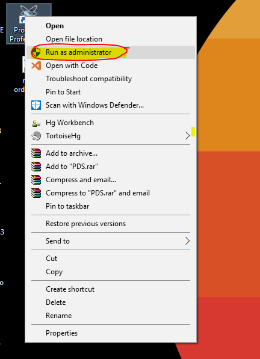  
2 - Create new project  
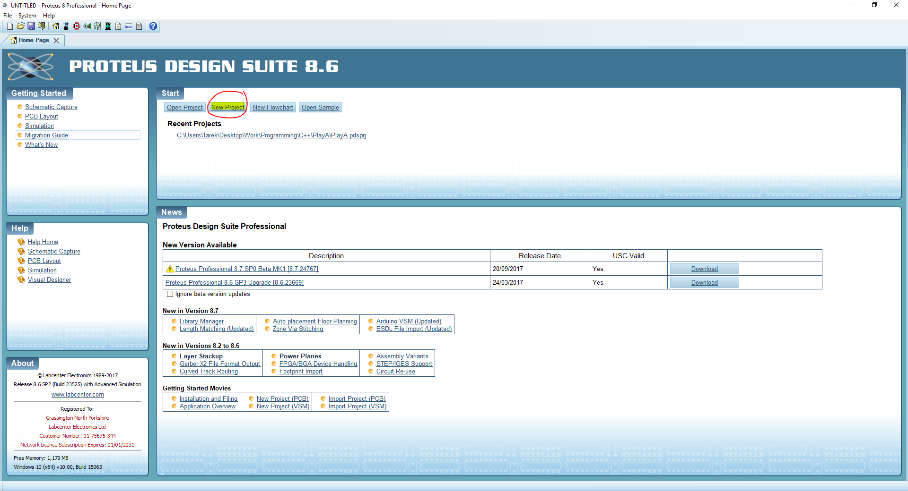  
3 - Name the project and choose where you want to save it.  
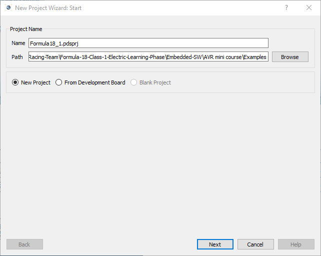  
4 - choose creat schematic
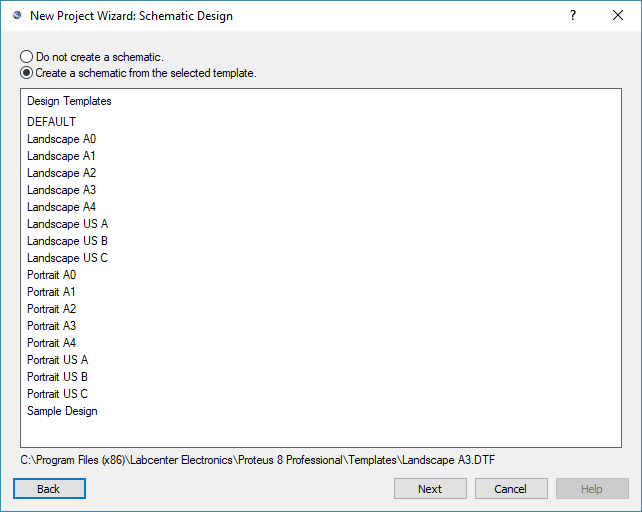  
5 - choose don't create a PCB  
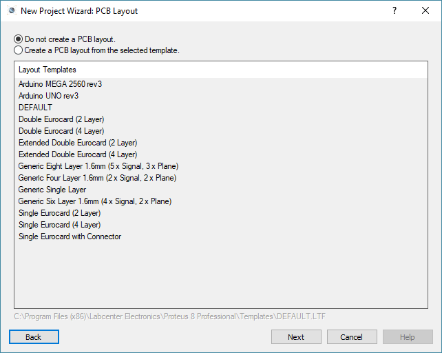  
6 - choose create firmware project.  
7 - choose AVR in Family.  
8 - choose ATmega328p in controller.  
9 - choose WinAVR in compiler.  
(if WinAVR is not one of the options, please make sure you installed WinAVR, then refere to the section at the end of the document)  
10 - check create quick start files.  
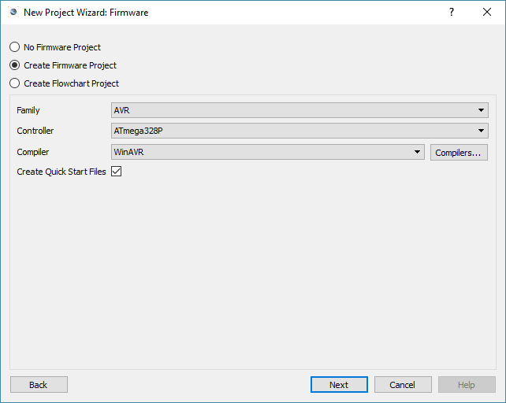
11 - you will be greated with 2 tabs:  
source code tab  
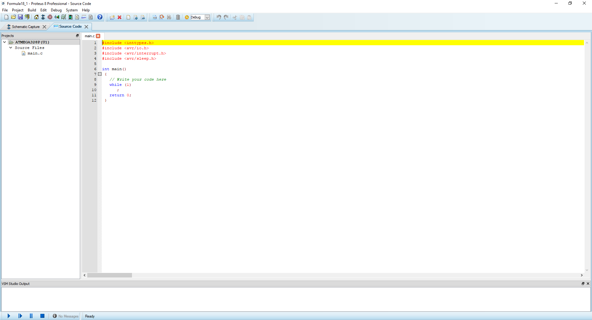
schematics tab  
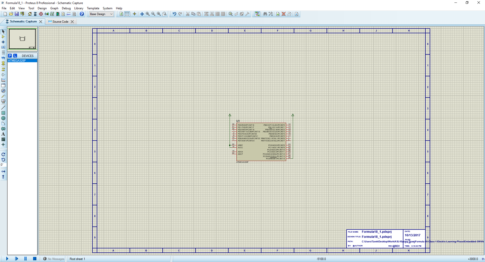

## WinAVR not detected problem
1 - in the create firmware project window click on compilers
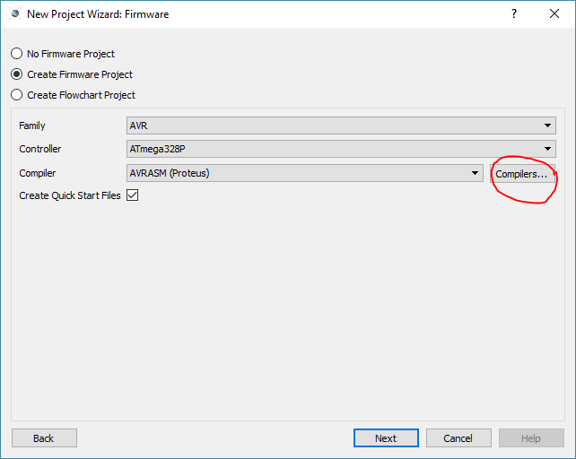
2 - a window will open, you will probably find a download button instead of Yes as the photo below
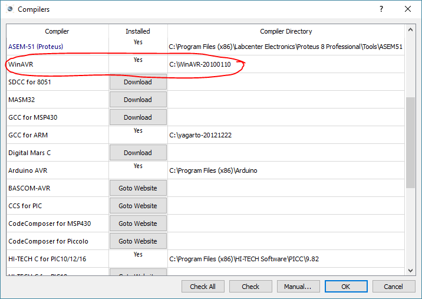
3 - click on check all 
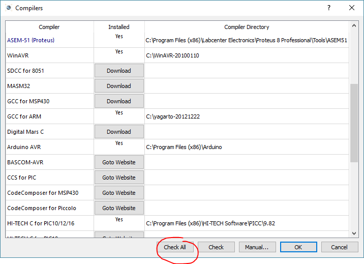
then a Yes should be written next to WinAVR, if not please send me a message