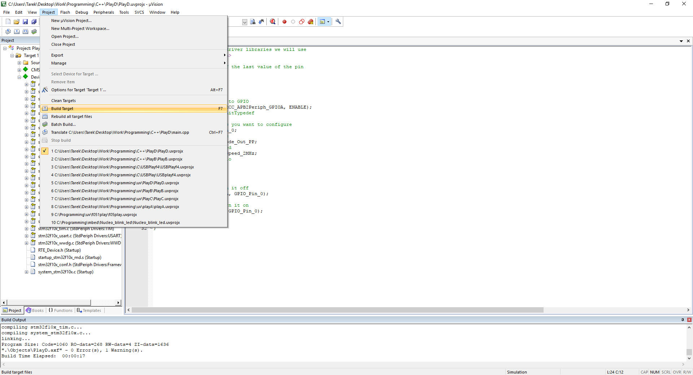
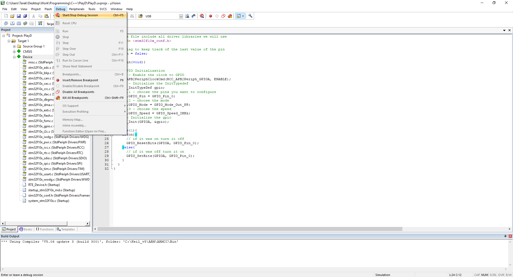
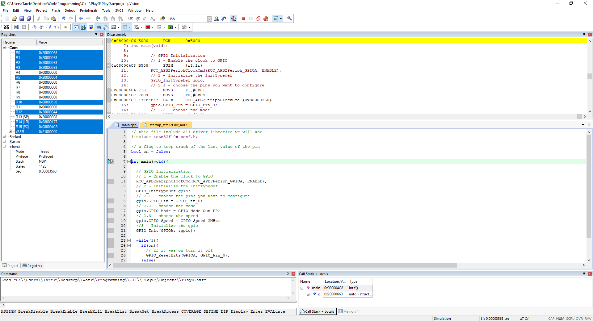
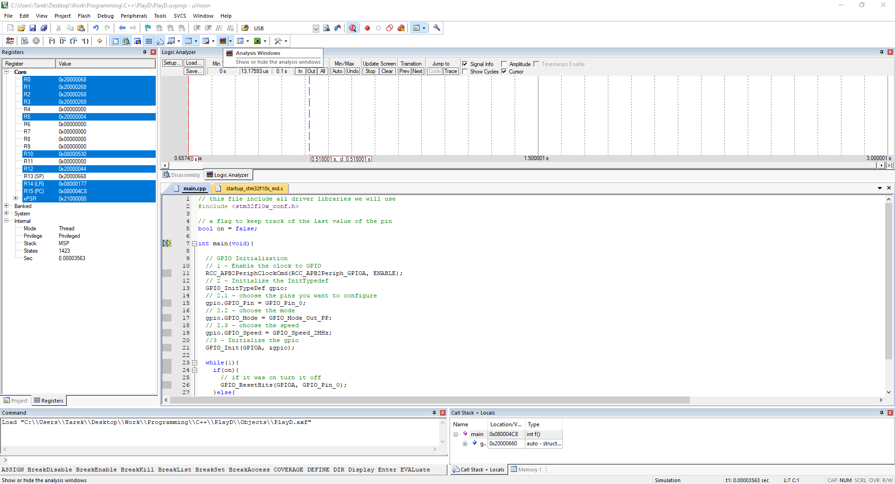
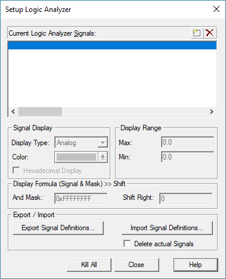
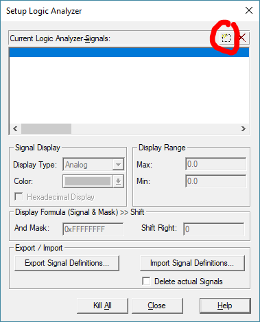
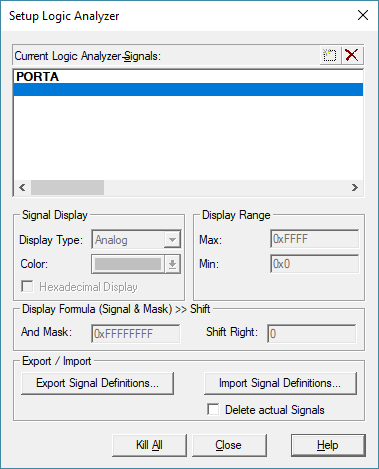
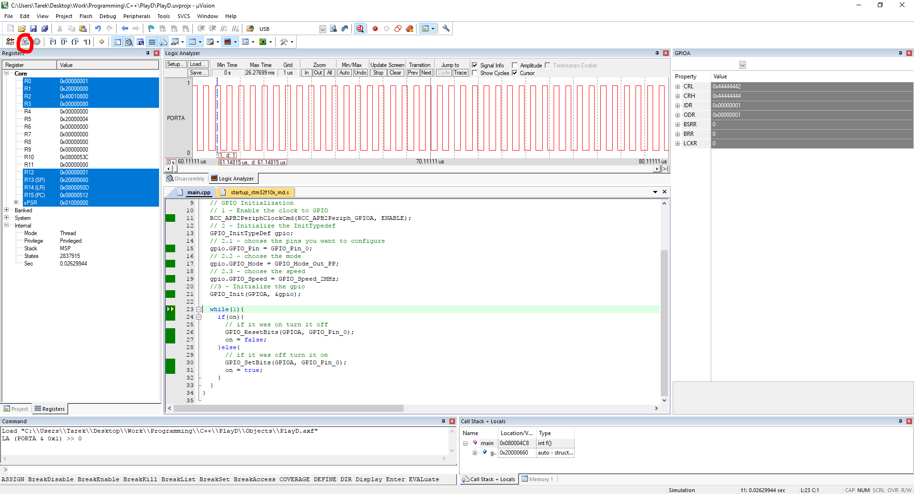

# STM32f103
## GPIO
All GPIO Ports have 16 pins and all configuration registers are 32 bit
### Code
explainantion in the comments

```C++
// this file include all driver libraries we will use
#include <stm32f10x_conf.h>

// a flag to keep track of the last value of the pin
bool on = false;

int main(void){
	
	// GPIO Initialization
	// 1 - Enable the clock to GPIO
	RCC_APB2PeriphClockCmd(RCC_APB2Periph_GPIOA, ENABLE);
	// 2 - Initialize the InitTypedef
	GPIO_InitTypeDef gpio;
	// 2.1 - choose the pins you want to configure
	gpio.GPIO_Pin = GPIO_Pin_0;
	// 2.2 - choose the mode
	gpio.GPIO_Mode = GPIO_Mode_Out_PP;
	// 2.3 - choose the speed
	gpio.GPIO_Speed = GPIO_Speed_2MHz;
	//3 - Initialize the gpio
	GPIO_Init(GPIOA, &gpio);
	
	while(1){
		if(on){
			// if it was on turn it off
			GPIO_ResetBits(GPIOA, GPIO_Pin_0);
		}else{
			// if it was off turn it on
			GPIO_SetBits(GPIOA, GPIO_Pin_0);
		}
	}
}
```
### Running the simulation
1 - Build the Project (shortcut F7).  

2 - Start debugging/simulation.  
   
3 - The debugger View.  
3.1 - on the left is a view of all the internal CPU registers.  
3.2 - on the top right is the disassembly view.    
3.3 - in the middle right is the source code view.  
3.4 - int the bottom right is the locals view, a view of all the local variables in the current scope.    

4 - The logic analyser.  
click on the analyser windows, a logic analyser view will appear.  

to configure the logic analyser to show the output pin click on setup and you will get the following configuration window.  
  
to add a new signal click on the highlighted button.  
  
then you can type the name of the port you want to monitor.  
  
then you select the name you just typed to setup the mask and Display type.  
  
5 - Run the simulation.  

6 - Pause the simulation.  
  

# SysTick
System Tick is a timer in almost all ARM processor that is usually used for scheduling tasks and helping operating systems.
## Code
```C++
// this file include all driver libraries we will use
#include <stm32f10x_conf.h>

int main(void){
	
    // this is the function to configure and enable SysTick and Interrupt
    // the function takes one argument
    // that is the number of clock cycles it should wait 
    // before generating an interrupt
    // in this example I choose whatever the system clock is divided by 1000
    // which means an interrupt will be generate 1000 times a second
    // once every millisecond
	SysTick_Config(SystemCoreClock/1000);
	while(1);
	}
}

// the ISR for SysTick
extern "C" void SysTick_Handler(void){
    // code here
}
```

# Resources
http://www.longlandclan.yi.org/~stuartl/stm32f10x_stdperiph_lib_um/Library_Examples.html
http://stm32.kosyak.info/doc/