# Keil uVision IDE and Simulator
## Creating a new project

1 - From the project menu create a new uVision Project and create a new folder for it and give it a name.  

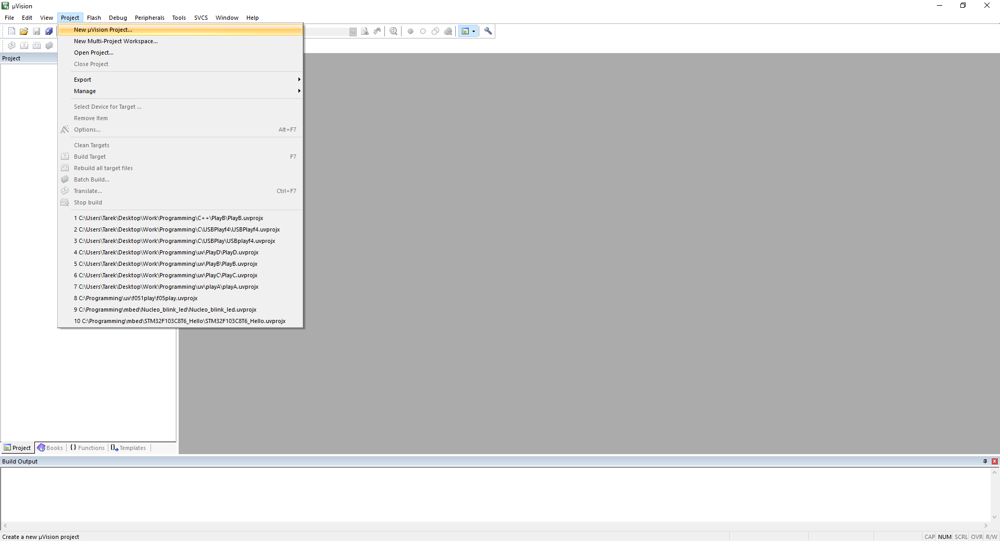

2 - You have to select a target device for the project, we will be working with stm32f103c8 most of the time.  

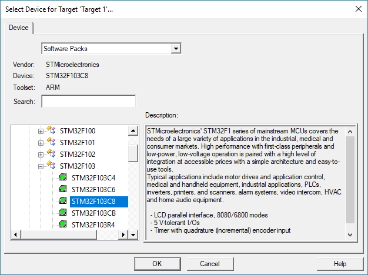

3 - Third you have to select what libraries to include.  
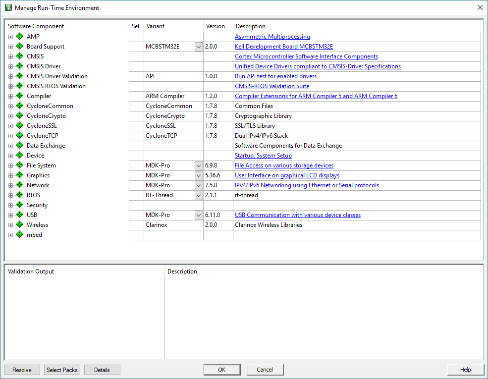

3.1 - Under CMSIS check the box next to CORE and DSP.  
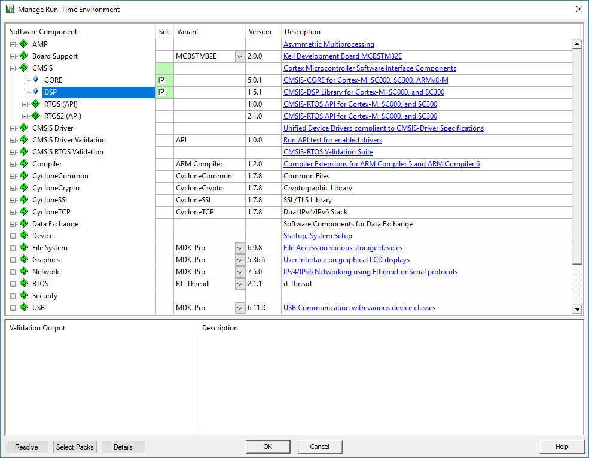
3.2 - Under Device check the box next to startup.    
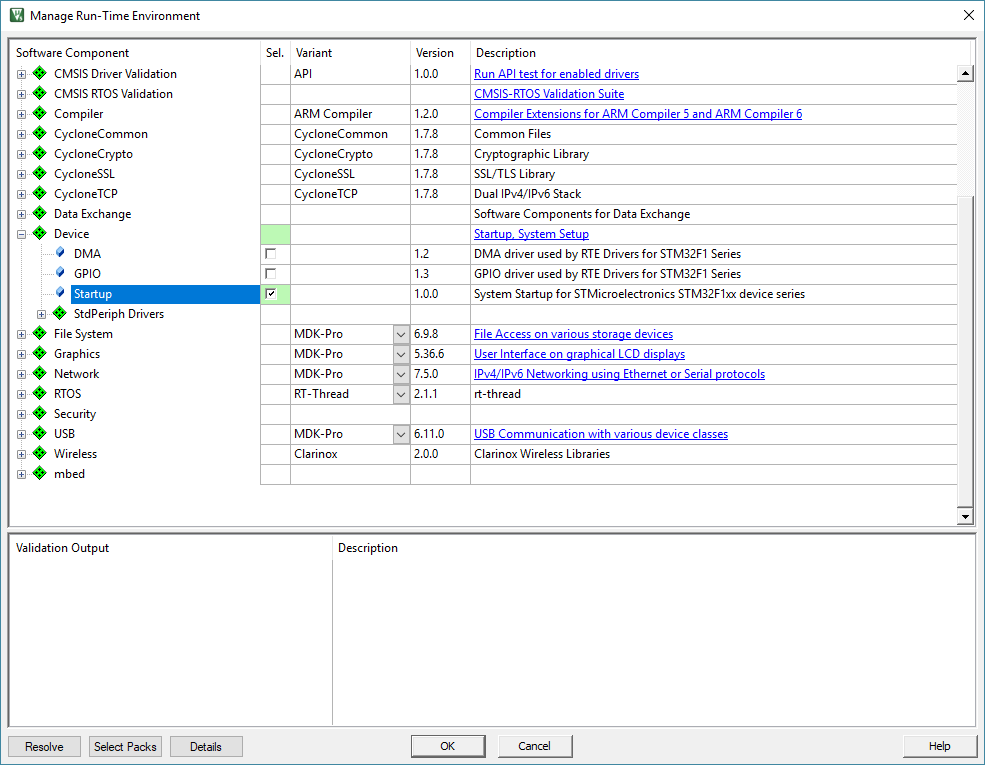
3.3 - Under Device and under StdPeriph Drivers check everything (not everything is shown in the picture but you have to select everything).  
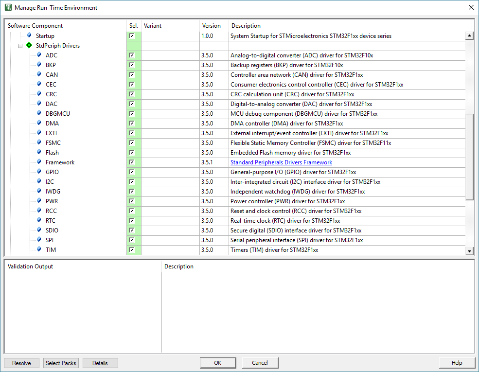
4 - Now you project is created.  

5 - Create a main file.
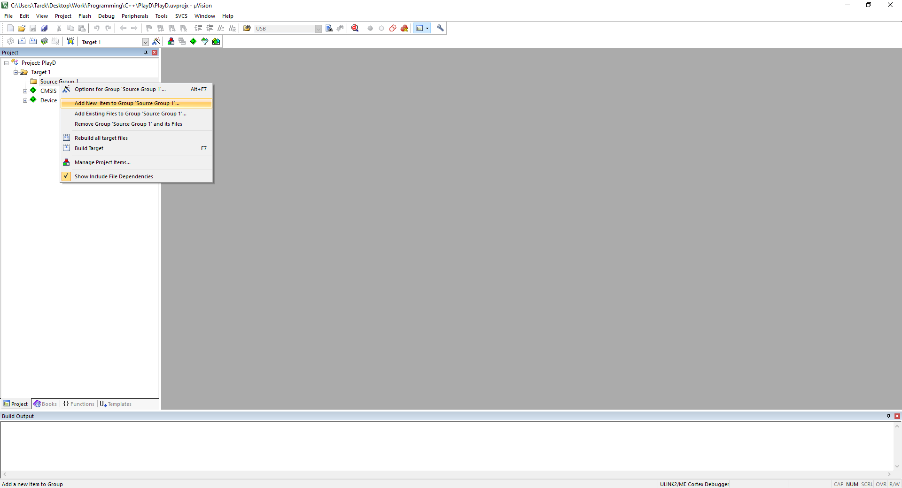
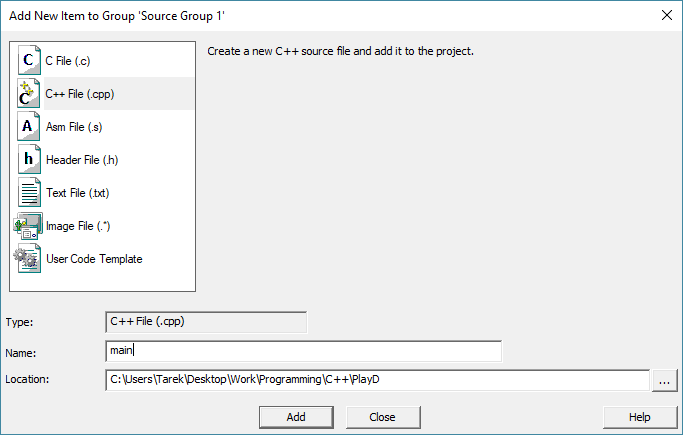

## Configuring the simulator

1 - double click on Target.  
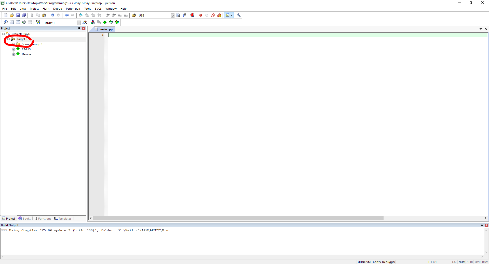
2 - In Project menu select options for target1.  
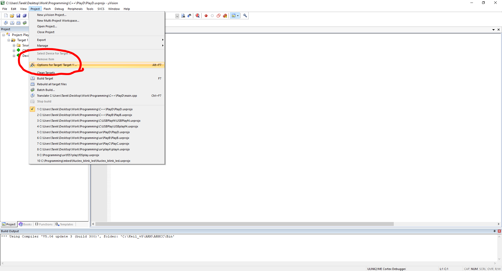
3 - In the Target tab change Xtal to 8.  
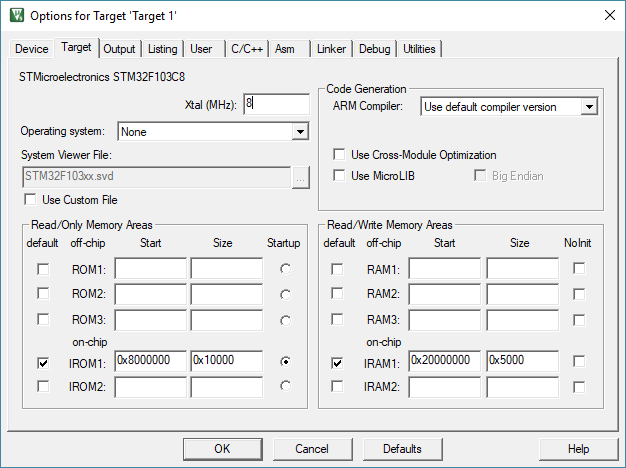  
4 - In the Debug tab select simulator and check Limit Speed to Real-Time and Load Application at Startup.  
5 - and change Dialog DLL to DARMSTM.DLL.  
6 - and change paramter to -pSTM32F103C8.  
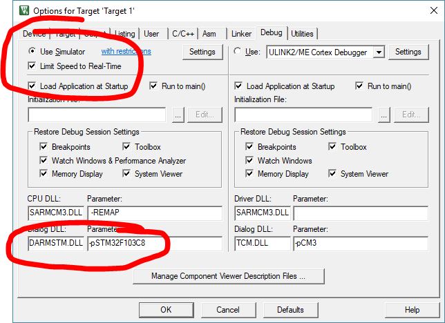

