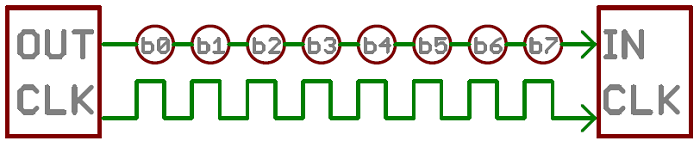

# AVR Crash Course
### Table of Content
1 - External Interrupts.  
2 - Timers.  
3 - ADC.  
4 - UART.  
## Interrupts
Interrupts are a mechanism to allow out of order execution of code based on an event happening, for example change of the voltage on a pin
### Last Homework using interrupts
#### Project 1
```C
#include <stdint.h>
#include <avr/io.h>
#include <avr/interrupt.h>

// Interrupt service routine
ISR(INT0_vect){
    // toggle LED
    PORTD ^= (1<<PD0);
}
int main()
 { 
    // interrupt on falling edge
    EICRA &= ~(1<<ISC00);
    EICRA |= (1<<ISC01);
    // enable external interrupt INT0
    EIMSK |= (1<<INT0);
    // PD0 as output
    DDRD |= (1<<PD0);
    // enable global interrupts
    sei();
    while (1);
    return 0;
 }
```
#### Project 2
```C
#include <inttypes.h>
#include <avr/io.h>
#include <avr/interrupt.h>
#include <util/delay.h>

// counter has to be volatile or it will get optimised away
volatile uint8_t counter = 0;

ISR(INT0_vect){
    // turn of LEDs
    PORTD &= ~((1<<PD0) | (1<<PD1) | (1<<PD3));
    // increase counter
    counter = (counter + 1) % 3;
}


int main(){ 
    // PD2 as input
    DDRD &= ~(1<<PD2);
    // PD0, PD1, and PD3 as output
    DDRD = (1<<PD0) | (1<<PD1) | (1<<PD3); 
    // interrupt on falling edge
    EICRA &= ~(1<<ISC00);
    EICRA |= (1<<ISC01);
    // enable external interrupt INT0
    EIMSK |= (1<<INT0);    
    // enable global interrupts
    sei();
    while (1){
        if(counter == 0){
	        PORTD ^= (1<<PD0);
        }else if(counter == 1){
	        PORTD ^= (1<<PD1);
        }else if(counter == 2){
	        PORTD ^= (1<<PD3);
        }
        _delay_ms(500);
    }
    return 0;
 }
```
#### Project 3
```C
#include <inttypes.h>
#include <avr/io.h>
#include <avr/interrupt.h>
#include <util/delay.h>

// has to be volatile
volatile uint8_t counter = 0;

// Interrupt Service Routine
ISR(INT0_vect){
   counter = (counter + 1)%2;
}


int main(){ 
    // PD2 as input
    DDRD &= ~(1<<PD2);
    // PD0 as output
    DDRD = (1<<PD0); 
    // interrupt on falling edge
    EICRA &= ~(1<<ISC00);
    EICRA |= (1<<ISC01);
    // enable external interrupt INT0
    EIMSK |= (1<<INT0);    
    // enable global interrupts
    sei();
    while (1){
      // blink LED
      PORTD ^= (1<<PD0);
      // change delay based on state
      if(counter == 0){
	_delay_ms(500); 
      }else if(counter == 1){
	_delay_ms(50);
      } 
   }
   return 0;
 }
```
## Timers
In AVR Timer is simply a counter that counts with a fixed frequency, which means that the timer has 1 added to it's value every fixed amount of time automatically, without you having to write the code that does the addition.   
Also Timers can generate an interrupt based on 2 kinds of events, an overflow event, which means that the timer has reached it's maximum value and started counting from zero again, or a compare match, which means the timer has reached a value that specified.  
We can control the frequency of the timer's counting be setting it's prescaler,which is simply a frequency divider, it takes the CPU frequency and divides it by some number.
ATmega328 has 3 timers:
## Timer 0
8 bit, which means it can count up to 255 then overflow back to 0.
2 compare channels, can be contineously compared to 2 values and generate an interrupt or automatically change an output pin.
### Timer 0 Overflow Interrupt
To calculate the time needed for a timer to overflow we follow the following equation.
```C
t = 255*prescaler/F_CPU;
```
#### Example 1:
Using a prescaler of 1024 and by default on protues the frequency of the CPU is 1MHz we get (255*1024/1000000) = 261 ms
```C
#include <avr/io.h>
#include <avr/interrupt.h>
#include <stdint.h>

int main(){ 
    // Timer 0 prescaler to 1024
    TCCR0B |= (1<<CS00) | (1<<CS02);
    TCCR0B &= ~(1<<CS01);
    // Enable Overflow interrupt
    TIMSK0 |= (1<<TOIE0);
    // Gpio pin PD0 initilization
    DDRD |= (1<<PD0);
    PORTD &= ~(1<<PD0);
    sei();
    while (1);
 }

ISR(TIMER0_OVF_vect){
    PORTD ^= (1<<PD0);
}
```
#### Example 2:
Sometimes we need to manage multiple more complex timings that are larger than what the timer can provide, so sort of create a virtual timer based on the actual timer.   
here we use a prescaler of 8 which gives us period of 2.04 ms.   
then we use different counters that manage different times that are multiple of that period.  
```C
#include <avr/io.h>
#include <avr/interrupt.h>
#include <stdint.h>

volatile uint16_t counter1 = 0;
volatile uint16_t counter2 = 0;
volatile uint16_t counter3 = 0;

int main(){ 
    // Timer 0 prescaler to 8
    TCCR0B |= (1<<CS01);
    TCCR0B &= ~((1<<CS00) | (1<<CS02));
    // Enable Overflow interrupt
    TIMSK0 |= (1<<TOIE0);
    // PD0, PD1, PD3 as output
    DDRD |= (1<<PD0) | (1<<PD1) | (1<<PD3);
    PORTD &= ~((1<<PD0) | (1<<PD1) | (1<<PD3));
    sei();
    while (1){
      if(counter1 == 500){
	  PORTD ^= (1<<PD0);
	  counter1 = 0;
      }
      if(counter2 == 200){
	  PORTD ^= (1<<PD1);
	  counter2 = 0;
      }
      if(counter3 == 1000){
	  PORTD ^= (1<<PD3);
	  counter3 = 0;
      }
    }
    return 0;
 }

ISR(TIMER0_OVF_vect){
    counter1++;
    counter2++;
    counter3++;
}
```
### Compare Channels, Timer1, and Timer2 are up to you to read about and try.
## ADC
ADC stands for analog to digital converter, as the name implies it can convert an analog voltage on a pin to a digital number.   
ATmega328p has a 10 bit ADC, that means it can convert a 0V-5V analog value to a number between 0-1023, with 0 being 0V and 1023 being 1023, to know what a certain voltage value will be use **cross multiplication**.  
The ADC can read from 8 different external pins one at a time.  
The ADC usually runs in the background and takes some time to do it's   conversion.  
the steps will usually be as follows:  
1 - configure the adc.  
2 - start conversion in main.  
3 - when the conversion is completed, an interrupt is generated.  
4 - inside the interrupt start conversion again if not in continous mode.  

### Single Conversion on 1 Pin Example
```C
#include <avr/io.h>
#include <avr/interrupt.h>
#include <stdint.h>


volatile uint16_t adc0_value = 0;

ISR(ADC_vect){
    // save last conversion value
    adc0_value = ADC;
    // start new conversion
    ADCSRA |= (1<<ADSC); 
}
int main(void){
    DDRD |= (1<<PD0);
    // ADEN enable ADC
    // ADIE enable ADC interrupt
    // prescaler of 64, on 1MHz is 15.625 KHz
    ADCSRA |= (1<<ADEN) | (1<<ADPS2) | (1<<ADPS1) | (1<<ADIE);
    // Enable Global Interrupts
    sei();
    // start the initial conversion to generate the first interrupt
    ADCSRA |= (1<<ADSC); 
    while(1){
       if(adc0_value > 50){
	  PORTD |= (1<<PD0);
       }else{
	  PORTD &= ~(1<<PD0);
       }
    }
}

```
### Single Conversion on 2 Pins Example
```C
#include <avr/io.h>
#include <avr/interrupt.h>
#include <stdint.h>


volatile uint16_t adc0_value = 0;
volatile uint16_t adc1_value = 0;
volatile uint8_t current_pin = 0;

ISR(ADC_vect){
    if(current_pin == 0){
       adc0_value = ADC;
       // clear the lower 4 bits ADMUX which represent the MUX selection bits
       ADMUX &= 0xf0;
       // write the value of the next pin
       ADMUX |= 1;
       // update current_pin to be the next pin
       current_pin = 1;
    }else if(current_pin == 1){
       adc1_value = ADC;
       // clear the lower 4 bits ADMUX which represent the MUX selection bits
       ADMUX &= 0xf0;
       // write the value of the next pin
       ADMUX |= 0;
       // update current_pin
       current_pin = 0;
    }
    // start new conversion
    ADCSRA |= (1<<ADSC);
}

int main(void){
    DDRD |= (1<<PD0) | (1<<PD1);
    ADCSRA |= (1<<ADEN) | (1<<ADPS2) | (1<<ADPS1) | (1<<ADIE);
    // Enable Global Interrupts
    sei();
    // start the initial conversion to generate the first interrupt
    ADCSRA |= (1<<ADSC); 
    while(1){
       if(adc0_value > 800){
	  PORTD |= (1<<PD0);
       }else{
	  PORTD &= ~(1<<PD0);
       }
       if(adc1_value > 200){
	  PORTD |= (1<<PD1);
       }else{
	  PORTD &= ~(1<<PD1);
       }
    }
}

```
## USART
Universal Synchronous/Asynchronous Reciever Transmitter is a serial communication protocol that very common in embedded applications.   
first what is parrallel and what is serial communincations.
### Parrallel Communication
usually we need to send multiple bits of data (a number), one way to to that is to have as many wires as the bits we need to send at one time, and an extra wire to signal to the other side when to read these bits (clock).  
but as you can see that can get very messy, it uses too many wires and too many pins and with that comes a lot of noise.
but it's the fastest communication there is.


### Synchronous Serial Communication
on the other hand serial communication sends the bits **serially** one bit after another combined with a clock line to tell the reciever when to read the bits, you can have 2 wire communication that is mostly one way.



### Asynchronous Serial Communication
Asynch serial communication is the exact same as normal serial but it doesn't need a clock line, instead the reciever and transmitter sort of agree on an imaginary clock with a known frequency - called baud rate -, it works the same, only problem if the reciever and transmitter expect different frequencies they won't be able to communicate.

### UART Frames
when using UART (without the S) the message has a certain format that we call a data frame, some parameters of that format need to be configured and the reciever and transmitter need to agree on these parameters.  

#### Start Bit
There is always a start bit that is a always a 0 stuffed in at the start of each frame.
#### Data Length
you can choose a data length (how many bits you want to send in each frame), usually it's a value between 5 and 9, with 8 and 9 being the most widely supported and 8 being the most commonly used.
#### Parity Bit
it can calculate an even or off parity bit for error checking
#### Stop Bits
you can choose to have one or 2 stop bits

### UART Transmit Examples
configuration steps are:  

1 - choose a baud rate with low error value given you CPU frequency (datasheet).  
2 - calculate the value that needs to be in BRR (baud rate register).  
3 - set the BRR.  
4 - configure data length, parity and stop bits.  
5 - enable transmitter.  

steps for sending a character:  

1 - make sure that the transmit buffer is empty.  
2 - but the character in UDR0.  

#### Send character

this just keeps sending the letter a
```C
#include <avr/io.h>
#include <stdint.h>

// we want a baud rate of 2400
#define USART_BAUDRATE 2400
// this is the equation for the value that we need to configure the baud rate
#define UBRR_VALUE (((F_CPU / (USART_BAUDRATE * 16UL))) - 1)

int main(void){
    // set baud rate 2400
    UBRR0L = UBRR_VALUE&0xff;
    UBRR0H = UBRR_VALUE>>8;
    // 8 data bits
    UCSR0C |= (1<<UCSZ00) | (1<<UCSZ01);
    // enable transmitter
    UCSR0B |= (1<<TXEN0);
    while(1){
	// wait for empty transmit buffer
        while (!( UCSR0A & (1<<UDRE0))); 
	// send data
	UDR0 = 'a'; 
    }
}

```

#### Send String

this keeps sending "hello world" on a new line
```C
#include <avr/io.h>
#include <avr/interrupt.h>

#include <stdint.h>
// we want a baud rate of 2400
#define USART_BAUDRATE 2400
// this is the equation for the value that we need to configure the baud rate
#define UBRR_VALUE (((F_CPU / (USART_BAUDRATE * 16UL))) - 1)

void send_string(const char *s, int len){
   int i = 0;
   for(i = 0; i < len; i++){
      // wait for empty transmit buffer
        while (!( UCSR0A & (1<<UDRE0))); 
	// send data
	UDR0 = s[i]; 
   }
}

int main(void){
    // set baud rate 2400
    UBRR0L = UBRR_VALUE&0xff;
    UBRR0H = UBRR_VALUE>>8;
    // 8 data bits
    UCSR0C |= (1<<UCSZ00) | (1<<UCSZ01);
    // enable transmitter
    UCSR0B |= (1<<TXEN0);
    while(1){
	send_string("hello world!\r\n",14);
    }
}

```

### UART Recieve is on you to read about and try.

# Homework
## Project 1
Build a project with 3 LEDs and a button, Initially the 3 LEDs are off.  
 - First button click time, LED1 on , lED2 off, LED3 off.  
 - Second button click LED1 blinking slowly,LED2 is on, LED3 off.
 - Third button click LED1 blinking fast, LED2 blinking slowly, LED3 is on.
 - Fourth button click LED1 off and LED2 blinking fast, and LED3 blinking slowly.
 - Fifth button click LED1 off, LED2 off, LED3 blinking fast.
 - Sixth button click resets to the initial state and start over again.
you should use external interrupts and timers as needed.
## Project 2
Build a project with a potentiometer and 5 LEDs as a progress bar, every 20% increase in the potentiometer value is represented by an LED being on.
## Project 3
Build a project with 1 LED, and using UART you can send to the microcontroller the letter '1' and it should turn the LED on, and sending the letter '0' should turn the LED off.